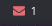

<div align="center">
	<h1>Polybar Mail</h1>
    <blockquote align="center">A <a href="https://github.com/jaagr/polybar">Polybar</a> module to show unread messages from mail inspired by <a href="https://github.com/crabvk/polybar-gmail">polybar-gmail</a></blockquote>
    <p>
    	<a href="https://github.com/ntk148v/polybar-mail/blob/master/LICENSE">
    		
    	</a>
    	<a href="https://github.com/ntk148v/polybar-mail/stargazers">
    		
    	</a>
    	<br>
<!--		<a href="https://github.com/ntk148v/polybar-mail/actions">
			
		</a>
		<a href="https://github.com/ntk148v/polybar-mail/actions">
			
		</a>
		<a href="https://github.com/ntk148v/polybar-mail/actions">
			
		</a>
		<br>-->
    </p><br>
</div>

## Preview





## Dependencies

- **Font Awesome** - default email icon.
- **canberra-gtk-play** - new email sound notification (optional).

## Installation

- Get polybarmail

```bash
git clone http://github.com/ntk148v/polybar-mail.git
cd polybar-mail
cp polybarmail.py ~/.config/polybar/polybarmail.py
cp mail.ini ~/.config/polybar/mail.ini
# Modify mail.ini with your mail configuration
```

- Scripts arguments

```bash
usage: polybarmail.py [-h] [--config CONFIG] [-p PREFIX] [-c COLOR] [-ns] [-dr DURATION]

optional arguments:
  -h, --help            show this help message and exit
  --config CONFIG
  -p PREFIX, --prefix PREFIX
  -c COLOR, --color COLOR
  -ns, --nosound
  -dr DURATION, --duration DURATION
```

- Update polybar config

```ini
[module/mail]
type = custom/script
exec = ~/.config/polybar/polybarmail.py
tail = true
click-left = xdg-open https://<your-mail-website>
```
